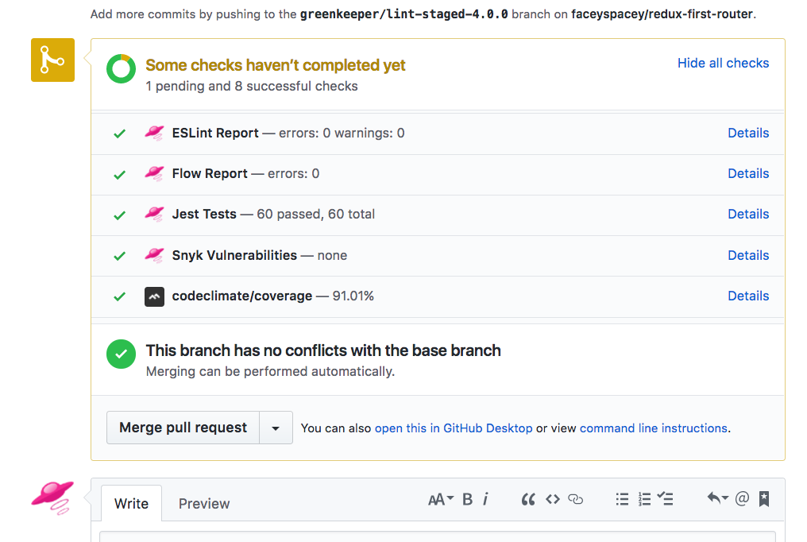

# travis-github-status 

<p align="center">
  <a href="https://www.npmjs.com/package/travis-github-status">
    
  </a>

  <a href="https://travis-ci.org/faceyspacey/travis-github-status">
    
  </a>

  <a href="https://lima.codeclimate.com/github/faceyspacey/travis-github-status/coverage">
    
  </a>

  <a href="https://greenkeeper.io">
    
  </a>

  <a href="https://lima.codeclimate.com/github/faceyspacey/travis-github-status">
    
  </a>

  <a href="https://www.npmjs.com/package/travis-github-status">
    
  </a>
  
  <a href="https://snyk.io/test/github/faceyspacey/travis-github-status">
    
  </a>

  <a href="https://www.npmjs.com/package/travis-github-status">
    
  </a>
</p>

This package tacks on additional status "checks" with meaningful messages to your builds as displayed on Github (in PRs, commits, etc).
That way developers can see all that went wrong (or right) with the build without leaving Github.



Use this as your primary means of running tests, linting and flow type checking. You will can list the services you want in your `.travis.yml` file as shown below.

**Supported Tools:**
- jest
- eslint
- flow
- snyk (vulernabilities reporting)
- codeclimate (test coverage)

*note: all tools will get a chance to run even if an earlier one fails--that way you have as much information as available
within github.*

## Installation
```yarn add --dev travis-github-status```

- 1 ) To allow 3rd party PRs to post post status checks to github, we have created a runkit endpoint you have to clone: https://runkit.com/faceyspacey/github-status-reporter-4-travis

- 2 ) Clone it, and connect with Github on the "environment variables" page: https://runkit.com/settings/environment
- 3 ) Then publish your runkit endpoint, and copy/paste its URL to your Travis repo's `RUN_KIT_URL` environment variable.


## Usage
Simply pass as args the names of checks to run (do not trigger your *npm test script* another way):

```yml
language: node_js

node_js:
  - stable

cache: yarn

script:
  - node_modules/.bin/travis-github-status lint flow jest snyk codeclimate #omit tools you don't want statuses for
```
> note: codeclimate uploads the coverage report to codeclimate.com, rather than reports a status


## Notes
As for security, yes anyone can now create a status on a build by pinging your end point. But nothing more. If they clone it, the way Runkit works is the clone will use that person's environment variables. So if they edit the code, whatever they do will only affect their account.

So as for creating statuses on your builds, it's basically harmless and not going to happen. A sneaky individual would need to go get your commit shas, etc, and fake it.
Then when they do, what happens? An extra message appears in a PR on github. Who cares. Likely never going to happen since it's so useless outside of its precise purpose. *But if I've missed something security-related, please let me know.*

## Contributing
We use [commitizen](https://github.com/commitizen/cz-cli), so run `npm run cm` to make commits. A command-line form will appear, requiring you answer a few questions to automatically produce a nicely formatted commit. Releases, semantic version numbers, tags and changelogs will automatically be generated based on these commits thanks to [semantic-release](https://github.com/semantic-release/semantic-release).


**TO DO:**
- Feel free to add more services such as Typescript, other test runners, etc.


### Tests
Yea, it's pretty much self-testing. It runs itself in the CI server (Travis), and if it can't run itself, it's failing,
but feel free to add some official unit tests and perhaps breakup the individual functions into individual files.
